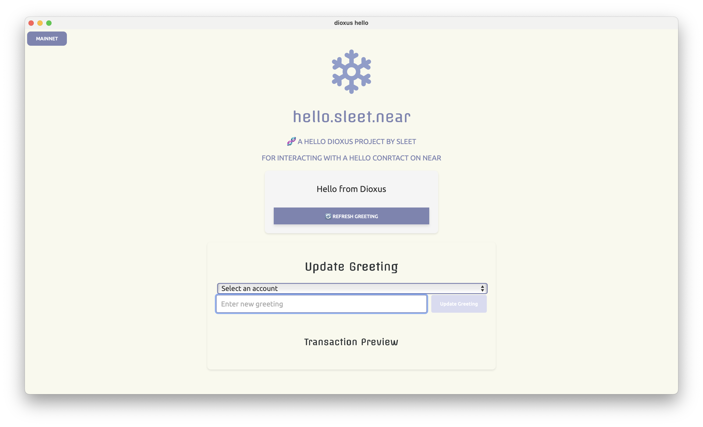

# dioxus_hello
🧬 a hello dioxus project by sleet for interacting with a hello conrtact on near 



----

### Dev Serving and Bundling Your App

serve
```bash
dx serve # the default platform is desktop
# dx serve --platform web
dx serve --platform desktop

# mobile testing
dx serve --platform android
dx serve --platform ios
```

bundle
```sh
# bundle for web
# dx bundle --platform web
# bundle for macOS
dx build --release --platform desktop

dx bundle --platform desktop \
    --package-types "macos" \
    --package-types "dmg"
```

```bash
# CARGO COMMANDS
cargo run
cargo check
cargo test
cargo clean
```


---

copyright 2025 by sleet.near
